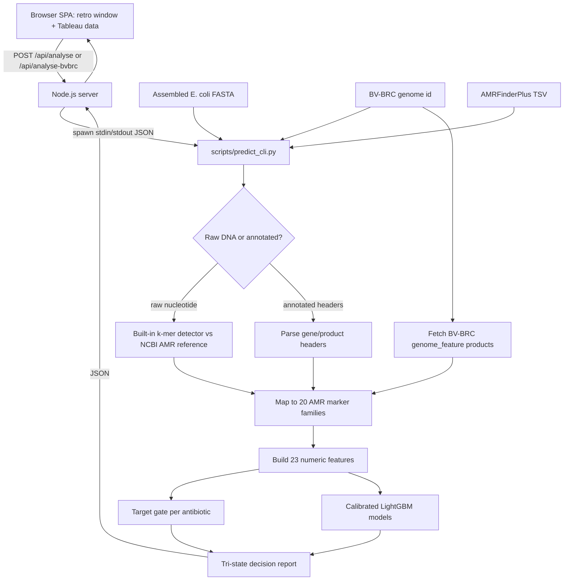

# AMRShield Sentinel

Node.js/TypeScript web app that predicts antibiotic response in E. coli from
genome-derived AMR marker features, backed by real calibrated LightGBM models
served through a Python inference bridge.

Output is tri-state: `likely_to_fail`, `likely_to_work`, or `no_call`. Every result includes probability, confidence, evidence category, target-gate status, and the required lab-confirmation warning.

> Research prototype only. Confirm every result with standard laboratory susceptibility testing.

## Architecture

The frontend is a retro-framed / Tableau-style single-page app served by a small
Node.js server. All real prediction happens in Python (trained LightGBM models +
k-mer FASTA detector + live BV-BRC gene fetch); the Node server shells out to a
standalone Python CLI over stdin/stdout.



### Run the app

```bash
pip install -r requirements.txt      # lightgbm, numpy, scikit-learn
npm install
npm run dev                          # builds TS, serves http://localhost:3000
```

The Node server calls `python` (override with `PYTHON_BIN`) to run
`scripts/predict_cli.py`. API surface: `GET /api/config`, `GET /api/metrics`,
`GET /api/bvbrc/training-dashboard`, `POST /api/analyse` (FASTA/TSV),
`POST /api/analyse-bvbrc` (`{ "genome_id": "562.12960" }`).

### Pluggable confidence engine

The component that turns a model probability into a **tri-state decision + confidence
score** is a swappable strategy. Each engine implements `decide(prob, target_ok)` and
`confidence(prob)`; the active one is chosen by `configs/app_config.json`
(`"decision_policy": { "engine": "threshold", "fail_threshold": 0.72, "work_threshold": 0.28 }`)
or the `CONFIDENCE_ENGINE` env var. Built-in engines: `threshold` (default, symmetric
max-probability confidence) and `entropy` (same boundaries, `1 - H(p)` confidence). The
active engine name is returned in every response as `confidence_engine`. Adding a new
engine (e.g. conformal prediction, learned abstention) is one subclass in
`scripts/predict_cli.py` plus one entry in the `ENGINES` map — nothing else in the
pipeline, server, or UI changes.

```bash
CONFIDENCE_ENGINE=entropy npm run dev   # swap engine without code changes
```

## Raw FASTA to Genes (Built-in Detector)

A raw genome assembly (just `>contig` headers and DNA) carries no gene names, so it
cannot be predicted without an annotation step. Instead of requiring an AMRFinderPlus
install, the app ships a **self-contained nucleotide AMR gene detector**:

1. `scripts/05_build_reference_index.py` downloads the public-domain NCBI AMRFinderPlus
   reference gene database (`AMR_CDS.fa`, ~9,700 real allele sequences) and builds a
   compact **MinHash k-mer index** (`artifacts/kmer_index.json`, ~1.5 MB, committed).
2. At upload time the genome is reduced to a set of canonical 21-mers (both strands),
   and each reference allele's sketch **containment** is measured. Containment >= 0.5
   marks a gene family as present. This is the same idea used by Mash / sourmash, in
   pure Python - no BLAST, no external tools, works offline after the one-time build.
3. Detected acquired genes plus the species' core chromosomal genes become the same
   20-family feature vector the LightGBM models were trained on.

Validated on a real 4.6 Mbp *E. coli* K-12 assembly: ~3.5 s scan, zero false-positive
acquired genes (only chromosomal `blaEC`/`ampC`), while a genome carrying real
`blaTEM`, `blaCTX-M`, `tetA`, `aadA`, `sul1`, `qnrS` sequences is called
`likely_to_fail` for all four drugs with the correct supporting markers.

## What Is Fixed

- Raw nucleotide FASTA uploads now work directly via the built-in k-mer AMR detector - no AMRFinderPlus or BLAST install required.
- AMRFinderPlus is still used automatically when `amrfinder` is available on `PATH`, and precomputed AMRFinderPlus TSV upload is also supported.
- A species name in a contig header is no longer mistaken for gene annotation (routing fix).
- The previous `genetic_group` predictive feature was removed to avoid lineage leakage.
- Calibration now uses `StratifiedGroupKFold` splits based on the grouped training data.
- PR-AUC now uses `average_precision_score`, not the previous broken trapezoid calculation.
- Target gates are deterministic per antibiotic target family before a `likely_to_work` result is allowed.
- The app text now matches the actual LightGBM model family and no-call policy.

## Dataset

- Source: BV-BRC public AST records and genome feature annotations.
- Species: E. coli, NCBI taxon 562.
- Scale: 92,452 AST rows, 8,725 unique genomes, 76 antibiotics in the downloaded label table.
- Modeled antibiotics: ampicillin, ciprofloxacin, ceftriaxone, tetracycline.
- Train/test split: grouped 80/20 split using `cgmlst_hc50`, with 6,979 train genomes and 1,746 test genomes.

Training is done as one binary model per antibiotic. The raw BV-BRC table has 92,452 AST rows, but each antibiotic model only uses genomes that have a resistant/susceptible label for that antibiotic after cleaning and de-duplication.

| Antibiotic | Train genomes | Train resistant | Train susceptible | Test genomes | Test resistant | Test susceptible | Total labeled genomes |
| --- | ---: | ---: | ---: | ---: | ---: | ---: | ---: |
| Ampicillin | 5,105 | 2,933 | 2,172 | 1,392 | 729 | 663 | 6,497 |
| Ciprofloxacin | 5,888 | 1,638 | 4,250 | 1,437 | 215 | 1,222 | 7,325 |
| Ceftriaxone | 803 | 399 | 404 | 161 | 55 | 106 | 964 |
| Tetracycline | 703 | 414 | 289 | 174 | 103 | 71 | 877 |

The committed training features are BV-BRC `genome_feature` product-name markers. For a stricter AMRFinderPlus rebuild, run AMRFinderPlus over the same genome assemblies and feed the TSV through the same marker parser used by `scripts/predict_cli.py`.

## End-to-End Process

1. Download BV-BRC AST labels and genome metadata.
   - Input: public BV-BRC E. coli AST records.
   - Output: `data/bvbrc/training_dataset.csv` and metadata files.
   - Scale used here: 92,452 AST rows across 8,725 genomes.

2. Fetch genome feature annotations.
   - Script: `python scripts/01_fetch_features.py`
   - Input: genome IDs from the BV-BRC dataset.
   - Output: `data/bvbrc/raw_features.jsonl`
   - Purpose: collect gene/product annotations used to detect AMR marker families.

3. Build model matrices.
   - Script: `python scripts/02_build_matrices.py`
   - Output: `feature_matrix.csv`, `labels.csv`, `splits.json`, `feature_columns.json`, `feature_meta.json`
   - Feature output: 20 binary AMR marker columns plus `amr_gene_burden`, `genome_length_z`, and `contigs_z`.
   - Split policy: grouped train/test split by `cgmlst_hc50`, so related genomes do not cross train/test.

4. Train calibrated models.
   - Script: `python scripts/03_train.py`
   - Model: one LightGBM classifier per antibiotic.
   - Calibration: `CalibratedClassifierCV` with `StratifiedGroupKFold`.
   - Leakage control: `genetic_group` is used only for grouping, not as a predictive feature.
   - Output: `artifacts/models/<antibiotic>_model.pkl` and `artifacts/model_meta.json`.

5. Evaluate held-out test data.
   - Script: `python scripts/04_evaluate.py`
   - Metrics: AUROC, PR-AUC, Brier score, no-call rate, answered accuracy, balanced accuracy, resistant recall, susceptible recall.
   - Output: `artifacts/demo_metrics.json`.

6. Serve the web app.
   - Command: `npm run dev` (Node server on `http://localhost:3000`), which calls `scripts/predict_cli.py` for real inference.
   - Inputs: raw/annotated FASTA (built-in k-mer detector), AMRFinderPlus TSV, or BV-BRC genome ID.
   - Output: tri-state antibiotic report plus Tableau-style charts and safety disclaimer.

## Feature Output Format

The model feature vector is ordered by `data/bvbrc/feature_columns.json`.

Current columns:

- 20 binary AMR marker features after prevalence filtering.
- `amr_gene_burden`: count of detected marker families.
- `genome_length_z`: normalized genome length when available, `0.0` for uploaded inference files.
- `contigs_z`: normalized contig count when available, `0.0` for uploaded inference files.

Runtime prediction output rows contain:

- `antibiotic`
- `decision`
- `prob`
- `confidence`
- `evidence_category`
- `markers`
- `target_status`
- `reason_codes`

## Model Performance

Held-out grouped test evaluation from `artifacts/demo_metrics.json`:

| Antibiotic | Test n | AUROC | PR-AUC | Brier | No-call | Answered accuracy | Balanced accuracy |
| --- | ---: | ---: | ---: | ---: | ---: | ---: | ---: |
| Ampicillin | 1,392 | 0.9593 | 0.9577 | 0.0570 | 0.0338 | 0.9457 | 0.9470 |
| Ciprofloxacin | 1,437 | 0.8631 | 0.6655 | 0.0989 | 0.2192 | 0.9278 | 0.8305 |
| Ceftriaxone | 161 | 0.9274 | 0.8724 | 0.0682 | 0.0435 | 0.9221 | 0.9212 |
| Tetracycline | 174 | 0.9626 | 0.9676 | 0.0601 | 0.0460 | 0.9398 | 0.9395 |

Decision thresholds:

- `P(resistant) >= 0.72`: `likely_to_fail`
- `P(resistant) <= 0.28`: `likely_to_work`
- otherwise: `no_call`

## Generalization by Genetic Group (honest reporting)

A single headline AUROC on an imbalanced dataset can be inflated by differences
*between* bacterial lineages rather than real per-sample signal. Following the judging
guidance, `scripts/04_evaluate.py` also reports AUROC broken down by cgMLST-derived
genetic group on held-out genomes (groups with >= 15 labeled test genomes):

| Antibiotic | Overall AUROC | Groups | Per-group mean AUROC | Worst-group AUROC |
| --- | ---: | ---: | ---: | ---: |
| Ampicillin | 0.959 | 11 | 0.883 | 0.608 |
| Ciprofloxacin | 0.863 | 10 | 0.345 | 0.158 |
| Ceftriaxone | 0.927 | - | n/a (test set too small for group split) | - |
| Tetracycline | 0.963 | - | n/a (test set too small for group split) | - |

**What this reveals:** ampicillin generalizes reasonably within lineages (marker genes
such as `blaTEM` carry real per-sample signal). Ciprofloxacin does **not**: its overall
0.863 is driven mostly by lineage prevalence, and within a related group the model can
barely rank cases, because the dominant mechanism (`gyrA`/`parC` point mutations) is not
visible to acquired-gene presence features. This is exactly why the system uses
calibrated probabilities and a `no_call` band - it abstains (ciprofloxacin no-call rate
21.9%) rather than overstating confidence. Reported per-drug metrics also include
balanced accuracy, resistant/susceptible recall, F1, PR-AUC, Brier score, and a
reliability curve (all in `artifacts/demo_metrics.json` and the app's Model Metrics tab).

## Run Locally

Install Python dependencies:

```bash
pip install -r requirements.txt
```

The committed `artifacts/kmer_index.json` already lets raw FASTA uploads work out of
the box. To rebuild it from the current NCBI reference:

```bash
curl -o data/amr_reference/AMR_CDS.fa \
  https://ftp.ncbi.nlm.nih.gov/pathogen/Antimicrobial_resistance/AMRFinderPlus/database/latest/AMR_CDS.fa
python scripts/05_build_reference_index.py
```

Optional, only if you prefer the gold-standard annotation for assembled FASTA:

```bash
amrfinder -n sample.fna -O Escherichia -o sample.amrfinder.tsv
```

Rebuild model artifacts:

```bash
python scripts/02_build_matrices.py
python scripts/03_train.py
python scripts/04_evaluate.py
```

Launch the app:

```bash
npm install
npm run dev
```

Then open `http://localhost:3000`.

## App Inputs

- **Raw or annotated FASTA** (Predict tab): raw nucleotide assemblies work via the built-in k-mer detector; annotated headers are parsed directly.
- **BV-BRC Genome ID**: fetches live public genome-feature annotations and runs the real models (e.g. `562.12960`).
- **AMRFinderPlus TSV**: precomputed AMRFinderPlus output (`POST /api/analyse` with `mode:"tsv"`).

## Repository Map

```text
hackNation/
  scripts/
    01_fetch_features.py          # BV-BRC gene fetch
    02_build_matrices.py          # feature matrix + grouped split
    03_train.py                   # LightGBM + calibration
    04_evaluate.py                # metrics + per-group generalization
    05_build_reference_index.py   # NCBI AMR k-mer index
    predict_cli.py                # standalone inference (called by Node)
  server/                         # Node.js API server
    index.ts
    pipeline/pythonBridge.ts      # spawns predict_cli.py
    pipeline/metrics.ts
    bvbrcData.ts
  client/app.ts                   # browser SPA (retro + Tableau)
  public/index.html public/styles.css
  shared/types.ts
  requirements.txt
  artifacts/
    demo_metrics.json  model_meta.json  kmer_index.json  models/
  data/bvbrc/
    feature_matrix.csv  labels.csv  splits.json  feature_columns.json
  demo_samples/
```

## Safety Scope

In scope: defensive E. coli AMR response prediction, explainable markers, calibrated uncertainty, no-call behavior, and lab-confirmation messaging.

Out of scope: clinical prescribing, organism design, resistance optimization, unsupported species, or replacing standard AST.
