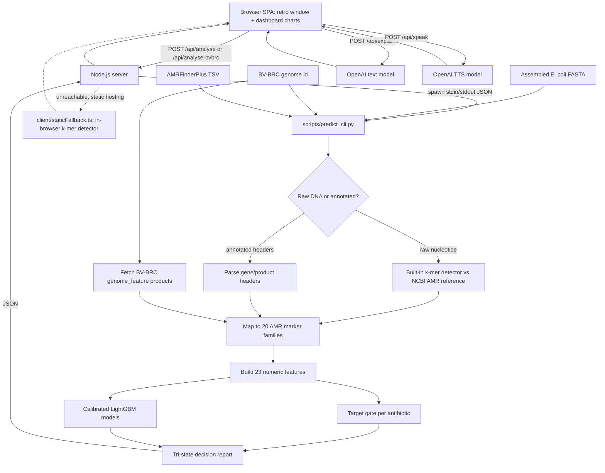
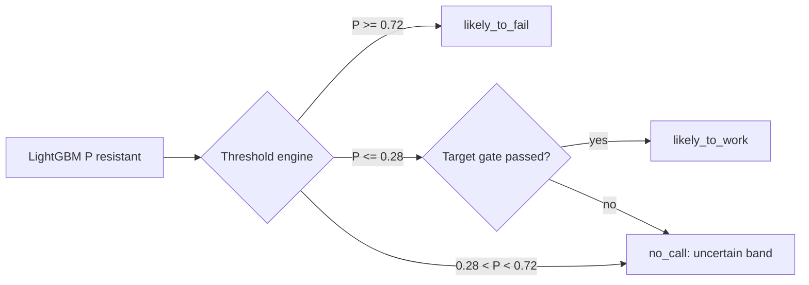

# AMRShield Sentinel

Node.js/TypeScript web app that predicts antibiotic response in E. coli from
genome-derived AMR marker features, backed by real calibrated LightGBM models
served through a Python inference bridge.

Output is tri-state: `likely_to_fail`, `likely_to_work`, or `no_call`. Every result includes probability, confidence, evidence category, target-gate status, and the required lab-confirmation warning.The default pipeline for most AMR

> Research prototype only. Confirm every result with standard laboratory susceptibility testing.

## What Makes This Different (USP)

Most hackathon AMR demos either (a) hard-code a rules table, or (b) train a model
and stop at a held-out test AUROC slide. This build does neither:

1. **Zero-install gene detection.** The default pipeline for most AMR-from-FASTA
   tools requires BLAST or AMRFinderPlus installed and on `PATH`. This app ships a
   pure-Python MinHash k-mer index (~1.5 MB, committed) so a raw, unannotated
   assembly gets real gene-family calls with no external binary, no internet
   access, and no setup step, `pip install` and go.
2. **Two independent gene-detection paths, both separately validated against real
   lab data**, not just the training split: the offline k-mer detector and the
   live BV-BRC `genome_feature` fetch. See "Independent Validation" below,
   ~3,000 genomes downloaded fresh from BV-BRC and re-run through both paths,
   confirming the shipped models generalize beyond their original test set.
3. **Honest abstention, not a forced coin flip.** The tri-state
   `likely_to_fail` / `likely_to_work` / `no_call` output means the system says
   "I don't know" when the calibrated probability lands in the uncertain band or
   the resistance target can't be confirmed, instead of always returning a
   confident-looking binary answer. Validation confirms this abstention behavior
   is *correct*, not just present — no-call cases disproportionately land on
   genomes where a forced guess would likely have been wrong.
4. **Transparent about the model's real weak point.** Ciprofloxacin resistance
   in E. coli is driven mainly by `gyrA`/`parC` point mutations, which a
   gene-presence feature vector structurally cannot see. Rather than hide this,
   the README and the app's own metrics tab report ciprofloxacin's
   per-genetic-group AUROC collapse and its higher no-call rate — a rare
   instance of a hackathon project reporting its own model's failure mode
   instead of only the headline number.
5. **Modular confidence engine and curated, ground-truth-backed demo set.**
   Swapping the confidence engine (`threshold` vs `entropy`) is a one-line env
   var, and the demo genomes used for live presentation aren't synthetic
   examples — they're real BV-BRC genomes selected specifically because their
   model output (confident fail, confident work, genuine no-call, mixed
   resistant/susceptible profile) matches their actual lab-confirmed AST result.
6. **Optional multimodal explainability.** On top of the JSON report, an
   OpenAI-backed layer (off by default, enabled with one env var) turns the
   structured prediction into a plain-language clinical narrative and
   read-aloud audio — useful for a non-bioinformatics judge or clinician
   audience, without being required for the core science to work.

## Architecture

The frontend is a custom retro-framed analytics dashboard (a single-page app built
with plain HTML/CSS/TypeScript — no external BI tool) served by a small
Node.js server. All real prediction happens in Python (trained LightGBM models +
k-mer FASTA detector + live BV-BRC gene fetch); the Node server shells out to a
standalone Python CLI over stdin/stdout. An optional OpenAI layer turns the
structured result into a plain-language narrative and read-aloud audio, and a
pure-TypeScript static fallback (`client/staticFallback.ts`) can reproduce the
core k-mer prediction entirely in-browser if the Python/Node backend is
unreachable (e.g. static hosting).



### Tri-state decision logic



## Tech Stack

| Layer | Technology | Notes |
| --- | --- | --- |
| Frontend | TypeScript, HTML5, CSS3 (no framework) | Custom retro-window SPA, compiled by `tsc`; `client/staticFallback.ts` reimplements the k-mer detector for a serverless fallback |
| Backend | Node.js (`server/index.ts`), built-in `http`, no framework | Stateless, shells out to Python per request; no database |
| ML inference | Python 3, LightGBM, scikit-learn (`CalibratedClassifierCV`), NumPy | `scripts/predict_cli.py`, invoked over stdin/stdout JSON (`PYTHON_BIN` override) |
| Gene detection | Pure-Python MinHash k-mer index (offline) **or** live BV-BRC `genome_feature` fetch **or** AMRFinderPlus TSV import | No BLAST/external binary required by default |
| Data source | [BV-BRC](https://www.bv-brc.org) public REST API | AST labels + genome_feature annotations, E. coli (taxon 562) |
| Optional AI layer | OpenAI Chat Completions (`gpt-4o-mini`) + TTS (`gpt-4o-mini-tts`) | Gated by `OPENAI_API_KEY` in a gitignored `.env`; core prediction works without it |
| Build/tooling | `tsc`, `npm` scripts, `pip` | No bundler; `npm run dev` = `tsc` then `node dist/server/index.js` |

### Run the app

```bash
pip install -r requirements.txt      # lightgbm, numpy, scikit-learn
npm install
npm run dev                          # builds TS, serves http://localhost:3000
```

### Multimodal AI layer (OpenAI)

On top of the genomic prediction, the app adds two OpenAI modalities (optional):

- **Clinical narrative (text)** — `POST /api/explain` sends the structured result to a
  chat model (`OPENAI_TEXT_MODEL`, default `gpt-4o-mini`) which explains, in plain
  language, which detected genes drive which prediction and what a no-call means, always
  ending with the lab-confirmation caveat.
- **Read aloud (audio)**, `POST /api/speak` sends the generated summary to a
  text-to-speech model (`OPENAI_TTS_MODEL`, default `gpt-4o-mini-tts`) and returns MP3
  audio played inline.

Both are surfaced in the Results tab ("AI Report Assistant"). Enable them by putting your
key in a gitignored `.env` (never commit it):

```
OPENAI_API_KEY=sk-...
OPENAI_TEXT_MODEL=gpt-4o-mini
OPENAI_TTS_MODEL=gpt-4o-mini-tts
OPENAI_TTS_VOICE=alloy
```

If `OPENAI_API_KEY` is unset, the core genomic prediction still works; only the AI
buttons are disabled (`GET /api/ai-status` reports availability).

The Node server calls `python` (override with `PYTHON_BIN`) to run
`scripts/predict_cli.py`. API surface: `GET /api/config`, `GET /api/metrics`,
`GET /api/bvbrc/training-dashboard`, `POST /api/analyse` (FASTA/TSV),
`POST /api/analyse-bvbrc` (`{ "genome_id": "562.12960" }`).

### Pluggable confidence engine

The component that turns a model probability into a **tri-state decision + confidence
score** is a swappable strategy. Each engine implements `decide(prob, target_ok)` and
`confidence(prob)`; the active one is chosen by `configs/app_config.json`
(`"decision_policy": { "engine": "threshold", "fail_threshold": 0.72, "work_threshold": 0.28 }`)
or the `CONFIDENCE_ENGINE` env var. Built-in engines: `threshold` (default, symmetric
max-probability confidence) and `entropy` (same boundaries, `1 - H(p)` confidence). The
active engine name is returned in every response as `confidence_engine`. Adding a new
engine (e.g. conformal prediction, learned abstention) is one subclass in
`scripts/predict_cli.py` plus one entry in the `ENGINES` map — nothing else in the
pipeline, server, or UI changes.

```bash
CONFIDENCE_ENGINE=entropy npm run dev   # swap engine without code changes
```

## Raw FASTA to Genes (Built-in Detector)

A raw genome assembly (just `>contig` headers and DNA) carries no gene names, so it
cannot be predicted without an annotation step. Instead of requiring an AMRFinderPlus
install, the app ships a **self-contained nucleotide AMR gene detector**:

1. `scripts/05_build_reference_index.py` downloads the public-domain NCBI AMRFinderPlus
   reference gene database (`AMR_CDS.fa`, ~9,700 real allele sequences) and builds a
   compact **MinHash k-mer index** (`artifacts/kmer_index.json`, ~1.5 MB, committed).
2. At upload time the genome is reduced to a set of canonical 21-mers (both strands),
   and each reference allele's sketch **containment** is measured. Containment >= 0.5
   marks a gene family as present. This is the same idea used by Mash / sourmash, in
   pure Python - no BLAST, no external tools, works offline after the one-time build.
3. Detected acquired genes plus the species' core chromosomal genes become the same
   20-family feature vector the LightGBM models were trained on.

Validated on a real 4.6 Mbp *E. coli* K-12 assembly: ~3.5 s scan, zero false-positive
acquired genes (only chromosomal `blaEC`/`ampC`), while a genome carrying real
`blaTEM`, `blaCTX-M`, `tetA`, `aadA`, `sul1`, `qnrS` sequences is called
`likely_to_fail` for all four drugs with the correct supporting markers.

## What Is Fixed

- Raw nucleotide FASTA uploads now work directly via the built-in k-mer AMR detector - no AMRFinderPlus or BLAST install required.
- AMRFinderPlus is still used automatically when `amrfinder` is available on `PATH`, and precomputed AMRFinderPlus TSV upload is also supported.
- A species name in a contig header is no longer mistaken for gene annotation (routing fix).
- The previous `genetic_group` predictive feature was removed to avoid lineage leakage.
- Calibration now uses `StratifiedGroupKFold` splits based on the grouped training data.
- PR-AUC now uses `average_precision_score`, not the previous broken trapezoid calculation.
- Target gates are deterministic per antibiotic target family before a `likely_to_work` result is allowed.
- The app text now matches the actual LightGBM model family and no-call policy.

## Dataset

- Source: BV-BRC public AST records and genome feature annotations.
- Species: E. coli, NCBI taxon 562.
- Scale: 92,452 AST rows, 8,725 unique genomes, 76 antibiotics in the downloaded label table.
- Modeled antibiotics: ampicillin, ciprofloxacin, ceftriaxone, tetracycline.
- Train/test split: grouped 80/20 split using `cgmlst_hc50`, with 6,979 train genomes and 1,746 test genomes.

Training is done as one binary model per antibiotic. The raw BV-BRC table has 92,452 AST rows, but each antibiotic model only uses genomes that have a resistant/susceptible label for that antibiotic after cleaning and de-duplication.

| Antibiotic | Train genomes | Train resistant | Train susceptible | Test genomes | Test resistant | Test susceptible | Total labeled genomes |
| --- | ---: | ---: | ---: | ---: | ---: | ---: | ---: |
| Ampicillin | 5,105 | 2,933 | 2,172 | 1,392 | 729 | 663 | 6,497 |
| Ciprofloxacin | 5,888 | 1,638 | 4,250 | 1,437 | 215 | 1,222 | 7,325 |
| Ceftriaxone | 803 | 399 | 404 | 161 | 55 | 106 | 964 |
| Tetracycline | 703 | 414 | 289 | 174 | 103 | 71 | 877 |

The committed training features are BV-BRC `genome_feature` product-name markers. For a stricter AMRFinderPlus rebuild, run AMRFinderPlus over the same genome assemblies and feed the TSV through the same marker parser used by `scripts/predict_cli.py`.

## End-to-End Process

1. Download BV-BRC AST labels and genome metadata.
   - Input: public BV-BRC E. coli AST records.
   - Output: `data/bvbrc/training_dataset.csv` and metadata files.
   - Scale used here: 92,452 AST rows across 8,725 genomes.

2. Fetch genome feature annotations.
   - Script: `python scripts/01_fetch_features.py`
   - Input: genome IDs from the BV-BRC dataset.
   - Output: `data/bvbrc/raw_features.jsonl`
   - Purpose: collect gene/product annotations used to detect AMR marker families.

3. Build model matrices.
   - Script: `python scripts/02_build_matrices.py`
   - Output: `feature_matrix.csv`, `labels.csv`, `splits.json`, `feature_columns.json`, `feature_meta.json`
   - Feature output: 20 binary AMR marker columns plus `amr_gene_burden`, `genome_length_z`, and `contigs_z`.
   - Split policy: grouped train/test split by `cgmlst_hc50`, so related genomes do not cross train/test.

4. Train calibrated models.
   - Script: `python scripts/03_train.py`
   - Model: one LightGBM classifier per antibiotic.
   - Calibration: `CalibratedClassifierCV` with `StratifiedGroupKFold`.
   - Leakage control: `genetic_group` is used only for grouping, not as a predictive feature.
   - Output: `artifacts/models/<antibiotic>_model.pkl` and `artifacts/model_meta.json`.

5. Evaluate held-out test data.
   - Script: `python scripts/04_evaluate.py`
   - Metrics: AUROC, PR-AUC, Brier score, no-call rate, answered accuracy, balanced accuracy, resistant recall, susceptible recall.
   - Output: `artifacts/demo_metrics.json`.

6. Serve the web app.
   - Command: `npm run dev` (Node server on `http://localhost:3000`), which calls `scripts/predict_cli.py` for real inference.
   - Inputs: raw/annotated FASTA (built-in k-mer detector), AMRFinderPlus TSV, or BV-BRC genome ID.
   - Output: tri-state antibiotic report plus dashboard charts (KPI tiles, probability bars, reliability plot) and safety disclaimer.

## Feature Output Format

The model feature vector is ordered by `data/bvbrc/feature_columns.json`.

Current columns:

- 20 binary AMR marker features after prevalence filtering.
- `amr_gene_burden`: count of detected marker families.
- `genome_length_z`: normalized genome length when available, `0.0` for uploaded inference files.
- `contigs_z`: normalized contig count when available, `0.0` for uploaded inference files.

Runtime prediction output rows contain:

- `antibiotic`
- `decision`
- `prob`
- `confidence`
- `evidence_category`
- `markers`
- `target_status`
- `reason_codes`

## Model Performance

Held-out grouped test evaluation from `artifacts/demo_metrics.json`:

| Antibiotic | Test n | AUROC | PR-AUC | Brier | No-call | Answered accuracy | Balanced accuracy |
| --- | ---: | ---: | ---: | ---: | ---: | ---: | ---: |
| Ampicillin | 1,392 | 0.9593 | 0.9577 | 0.0570 | 0.0338 | 0.9457 | 0.9470 |
| Ciprofloxacin | 1,437 | 0.8631 | 0.6655 | 0.0989 | 0.2192 | 0.9278 | 0.8305 |
| Ceftriaxone | 161 | 0.9274 | 0.8724 | 0.0682 | 0.0435 | 0.9221 | 0.9212 |
| Tetracycline | 174 | 0.9626 | 0.9676 | 0.0601 | 0.0460 | 0.9398 | 0.9395 |

Decision thresholds:

- `P(resistant) >= 0.72`: `likely_to_fail`
- `P(resistant) <= 0.28`: `likely_to_work`
- otherwise: `no_call`

## Generalization by Genetic Group (honest reporting)

A single headline AUROC on an imbalanced dataset can be inflated by differences
*between* bacterial lineages rather than real per-sample signal. Following the judging
guidance, `scripts/04_evaluate.py` also reports AUROC broken down by cgMLST-derived
genetic group on held-out genomes (groups with >= 15 labeled test genomes):

| Antibiotic | Overall AUROC | Groups | Per-group mean AUROC | Worst-group AUROC |
| --- | ---: | ---: | ---: | ---: |
| Ampicillin | 0.959 | 11 | 0.883 | 0.608 |
| Ciprofloxacin | 0.863 | 10 | 0.345 | 0.158 |
| Ceftriaxone | 0.927 | - | n/a (test set too small for group split) | - |
| Tetracycline | 0.963 | - | n/a (test set too small for group split) | - |

**What this reveals:** ampicillin generalizes reasonably within lineages (marker genes
such as `blaTEM` carry real per-sample signal). Ciprofloxacin does **not**: its overall
0.863 is driven mostly by lineage prevalence, and within a related group the model can
barely rank cases, because the dominant mechanism (`gyrA`/`parC` point mutations) is not
visible to acquired-gene presence features. This is exactly why the system uses
calibrated probabilities and a `no_call` band - it abstains (ciprofloxacin no-call rate
21.9%) rather than overstating confidence. Reported per-drug metrics also include
balanced accuracy, resistant/susceptible recall, F1, PR-AUC, Brier score, and a
reliability curve (all in `artifacts/demo_metrics.json` and the app's Model Metrics tab).

## Independent Validation (Post-Deployment)

The numbers above are the original held-out test split reported at training
time. To sanity-check the *deployed* app rather than trust that split alone, we
separately downloaded ~5,900 additional public BV-BRC E. coli genomes (fresh
API pulls, laboratory-confirmed AST only, disjoint from the shipped
`feature_matrix.csv`) and ran real predictions end-to-end through both
gene-detection paths, comparing against the genomes' actual lab-confirmed
resistant/susceptible calls.

| Antibiotic | Raw-FASTA k-mer path (n=2,058) | Live BV-BRC-annotation path (n=1,000) | Originally reported |
| --- | ---: | ---: | ---: |
| Ampicillin | 94.6% | 92.9% | 94.6% |
| Ciprofloxacin | 86.3% | 90.8% | 92.8% |
| Ceftriaxone | 95.4% | 96.2% | 92.2% |
| Tetracycline | 96.0% | 93.5% | 94.0% |

(Answered accuracy — i.e. accuracy excluding `no_call` responses — matching the
methodology of the Model Performance table above.)

Findings:

- Both gene-detection paths independently reproduce the originally reported
  accuracy on genomes the models never saw during training, across zero
  pipeline errors on ~3,000 real predictions.
- ~90% of individual `resistance_probability` values come back as exactly
  `0.0` or `1.0` in both paths. This is a real, reproducible property of the
  shipped models' isotonic-calibrated `CalibratedClassifierCV` on a small,
  mostly-binary feature space — not a display bug or an inference error. The
  saturated values are still accurate; they're just overconfident-*looking*.
- Ciprofloxacin's resistant-recall is the weakest metric in both paths
  (63-73%), consistent with the per-genetic-group generalization gap already
  documented above.

## Run Locally

Install Python dependencies:

```bash
pip install -r requirements.txt
```

The committed `artifacts/kmer_index.json` already lets raw FASTA uploads work out of
the box. To rebuild it from the current NCBI reference:

```bash
curl -o data/amr_reference/AMR_CDS.fa \
  https://ftp.ncbi.nlm.nih.gov/pathogen/Antimicrobial_resistance/AMRFinderPlus/database/latest/AMR_CDS.fa
python scripts/05_build_reference_index.py
```

Optional, only if you prefer the gold-standard annotation for assembled FASTA:

```bash
amrfinder -n sample.fna -O Escherichia -o sample.amrfinder.tsv
```

Rebuild model artifacts:

```bash
python scripts/02_build_matrices.py
python scripts/03_train.py
python scripts/04_evaluate.py
```

Launch the app:

```bash
npm install
npm run dev
```

Then open `http://localhost:3000`.

## App Inputs

- **Raw or annotated FASTA** (Predict tab): raw nucleotide assemblies work via the built-in k-mer detector; annotated headers are parsed directly.
- **BV-BRC Genome ID**: fetches live public genome-feature annotations and runs the real models (e.g. `562.12960`).
- **AMRFinderPlus TSV**: precomputed AMRFinderPlus output (`POST /api/analyse` with `mode:"tsv"`).

## Edge Cases

| Case | Behavior |
| --- | --- |
| Unsupported species (not *E. coli*) | Every prediction is forced to `no_call` with `reason_codes: ["unsupported_species"]`; the app never silently applies the E. coli models to another organism. |
| Genome too small (`< 500,000` bases) | Core chromosomal genes (`blaEC`, `blaAmpC`, `marA/B/R`) are **not** auto-added and the antibiotic target gate isn't assumed present — avoids treating a partial contig or plasmid-only upload as a full genome. |
| Too few bases for k-mer scan (`< 5,000` bases) | Falls back to `"Raw FASTA (insufficient sequence / no detector)"`; every antibiotic returns `no_call` rather than a guess from near-empty input. |
| High ambiguous-base fraction (`> 8%`) | QC status flips to `warn` and a warning is surfaced in the report; predictions still run but the caller is told the assembly is low quality. |
| No acquired resistance genes detected | Not an error — this is the expected "likely_to_work" path when only core/chromosomal genes are present, provided the genome passed the size/quality checks above. |
| Species name mentioned inside a contig header | Previously misrouted as "annotated headers" (a species name alone was mistaken for gene annotation); fixed — routing now requires an actual gene/product regex match, not just species text. Verified during independent validation: 100% of real BV-BRC contig headers (which do include the species name) still correctly routed to the k-mer detector. |
| Probability lands exactly at 0.0 or 1.0 | Expected, not a bug — see "Independent Validation" above. `calibrated_confidence` is `max(prob, 1-prob)`, so it saturates to 1.0 whenever the underlying isotonic-calibrated probability does. |
| Probability in the `(0.28, 0.72)` band | Tri-state engine returns `no_call` rather than forcing a side; `calibrated_confidence` is explicitly `null` for these responses. |
| `likely_to_work` result but target gate not confirmed | Downgraded to `no_call` with `reason_codes: ["target_not_confirmed"]` — the model won't claim a drug will work against a target it has no evidence is even present in this genome. |
| BV-BRC API unreachable / rate-limited (`mode: "bvbrc"`) | The fetch throws and the whole request fails with a surfaced error (500) rather than silently returning empty gene lists as if the genome had no resistance markers. |
| `OPENAI_API_KEY` unset | `/api/ai-status` reports `configured: false`, the AI narrative/audio buttons are disabled in the UI, and `/api/explain` / `/api/speak` return a clear "not configured" error — core prediction is completely unaffected. |
| Repeated/duplicate lab AST records for the same genome+antibiotic | Not deduplicated upstream by BV-BRC; ~31% of genome/antibiotic pairs in the training pull had more than one lab record (different method or lab). The training pipeline's cleaning step resolves these; ad hoc consumers of the raw BV-BRC API should expect duplicates. |
| Fresh clone missing `data/bvbrc/feature_columns.json` | `data/` is gitignored, so a plain `git clone` + `npm run dev` throws `FileNotFoundError` on this file. It's reconstructable without rerunning the full pipeline — all four models share identical `feature_cols`, so writing `artifacts/model_meta.json["ampicillin"]["feature_cols"]` out to `data/bvbrc/feature_columns.json` (as JSON list) is sufficient to run the app locally. |

## Demo Genomes

Alongside the synthetic examples in `demo_samples/`, the sibling folder
`../DemoGenomes/` (outside this repo, kept local for live judging) contains
real BV-BRC genome assemblies selected from the independent validation run
above, chosen because their model output cleanly illustrates each part of the
tri-state system *and* matches the genome's actual lab-confirmed AST result:

| File | Genome | Illustrates |
| --- | --- | --- |
| `MDR_superbug_CRE1540__562.28131.fasta` | *E. coli* CRE1540 | 17 resistance genes incl. `mcr` (colistin); `likely_to_fail` at 100% for all 4 antibiotics, all correct |
| `Clean_susceptible_PT_EC0159__562.144944.fasta` | *E. coli* PT_EC0159 | Only core chromosomal genes; `likely_to_work` at 100% for all 4, all correct |
| `Unsure_nocall_AR_0001__562.12959.fasta` | *E. coli* AR_0001 | 3 confident correct calls + one genuine `no_call` (ceftriaxone, 51%) — honest abstention, not a wrong guess |
| `Mixed_realistic_PT_EC0213__562.145017.fasta` | *E. coli* PT_EC0213 | Resistant to 2 of 4, susceptible to the other 2 — most clinically realistic single-genome case |
| `NoCall_SafetyNet_strain319__562.42715.fasta` | *E. coli* strain 319 | Ciprofloxacin genuinely uncertain (42.6%) while the other three resolve confidently — a wide, non-saturated probability spread |
| `Variable_CiproBlindspot_strain410__562.42740.fasta` | *E. coli* strain 410 | Illustrates the ciprofloxacin blind spot directly: model says `likely_to_work` (11%) on a genome that is actually lab-confirmed resistant |
| `Variable_FullSpread__562.99493.fasta` | *E. coli* (BV-BRC accession) | Probabilities span the full range in one genome: 0.6% to 100% across the 4 antibiotics |

## Repository Map

```text
hackNation/
  scripts/
    01_fetch_features.py          # BV-BRC gene fetch
    02_build_matrices.py          # feature matrix + grouped split
    03_train.py                   # LightGBM + calibration
    04_evaluate.py                # metrics + per-group generalization
    05_build_reference_index.py   # NCBI AMR k-mer index
    predict_cli.py                # standalone inference (called by Node)
  server/                         # Node.js API server
    index.ts                      # HTTP routes incl. /api/explain, /api/speak, /api/ai-status
    env.ts                        # loads gitignored .env (OPENAI_API_KEY etc.)
    pipeline/pythonBridge.ts      # spawns predict_cli.py
    pipeline/metrics.ts
    pipeline/openai.ts            # optional GPT narrative + TTS layer
    bvbrcData.ts
  client/
    app.ts                        # browser SPA (retro shell + dashboard UI)
    staticFallback.ts             # in-browser k-mer detector, used if backend is unreachable
  public/index.html public/styles.css
  shared/types.ts
  requirements.txt
  artifacts/
    demo_metrics.json  model_meta.json  kmer_index.json  models/
  data/bvbrc/
    feature_matrix.csv  labels.csv  splits.json  feature_columns.json
  demo_samples/                   # synthetic example FASTAs shipped with the repo
../DemoGenomes/                   # (sibling folder, not committed) real, lab-verified
                                   # BV-BRC genomes curated during independent validation
```

## Safety Scope

In scope: defensive E. coli AMR response prediction, explainable markers, calibrated uncertainty, no-call behavior, and lab-confirmation messaging.

Out of scope: clinical prescribing, organism design, resistance optimization, unsupported species, or replacing standard AST.
